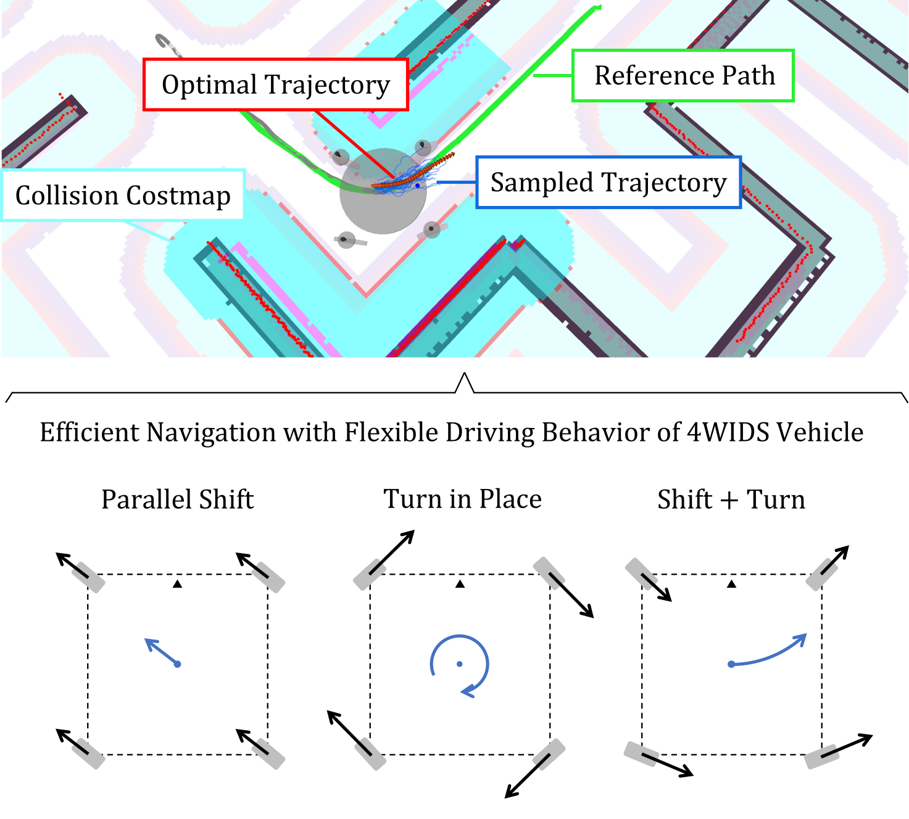

# mppi_swerve_drive_ros
MPPI (Model Predictive Path-Integral) Controller for a Swerve Drive Robot

> [!NOTE]
> An academic paper related to this project is now under review, and the source code will be open here after the paper is accepted.

<!-- eyecatch image -->

