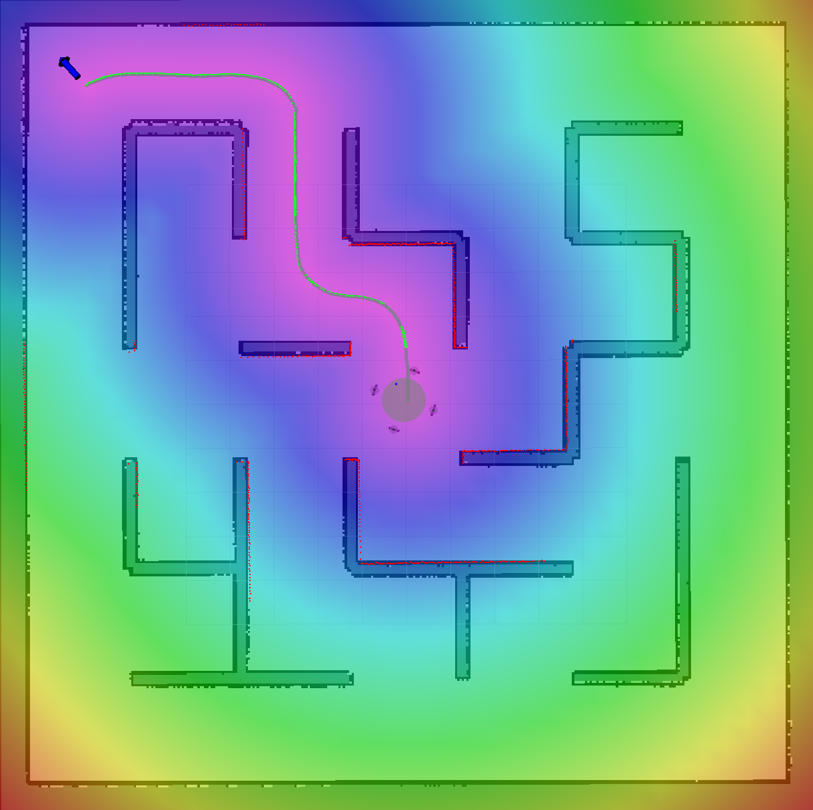
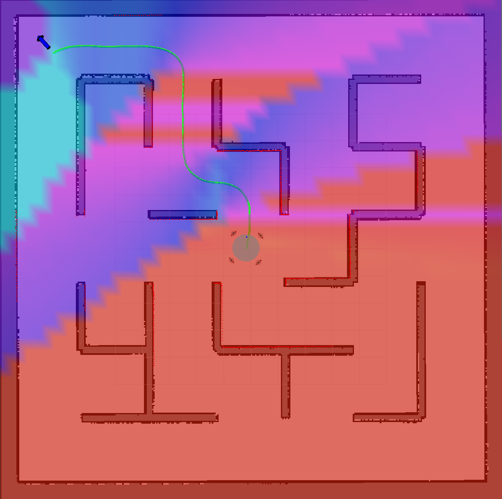

# reference_costmap_generator
This package generates a reference costmap from received global planning path.
MPPI planner receives and uses the reference costmap to evaluate cost of sampled trajectories.

## Subscribing Topics

| Topic name      | Type                 | Description                                                  |
| --------------- | -------------------- | ------------------------------------------------------------ |
| /move_base/NavfnROS/plan| nav_msgs/Path | Global planning path generated by move_base package.|
| /map | nav_msgs/OccupancyGrid | Occupancy grid map.|


## Publishing Topics

| Topic name      | Type              | Description                                                  |
| --------------- | ----------------- | ------------------------------------------------------------ |
| /goal_pose_marker | visualization_msgs/Marker | Goal pose marker for visualization.|
| /distance_error_map | nav_msgs/OccupancyGrid | Map of distance error from the global reference path.|
| /ref_yaw_map | nav_msgs/OccupancyGrid | Map of reference yaw angle for every position. |


## Node Parameters
| Parameter name               | Type   | Description                                                  |
| ---------------------------- | ------ | ------------------------------------------------------------ |
| ref_path_topic                | string | Topic name of the global planning path. |
| map_topic                    | string | Topic name of the occupancy grid map. |
| distance_error_map_topic     | string | Topic name of the distance error map. |
| ref_yaw_map_topic            | string | Topic name of the reference yaw map. |
| map_resolution_scale | double | 1.0 means the resolution of the reference costmap is the same as the occupancy grid map. Bigger value means lower resolution. |


## Usage
To launch the node individually, run the following commands.
```
source devel/setup.bash
roslaunch reference_costmap_generator reference_costmap_generator.launch
```

## Note
Here are visualizations of the maps generated by this node.

### distance_error_map


### ref_yaw_map

